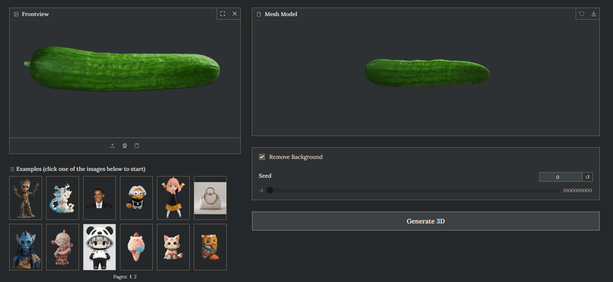
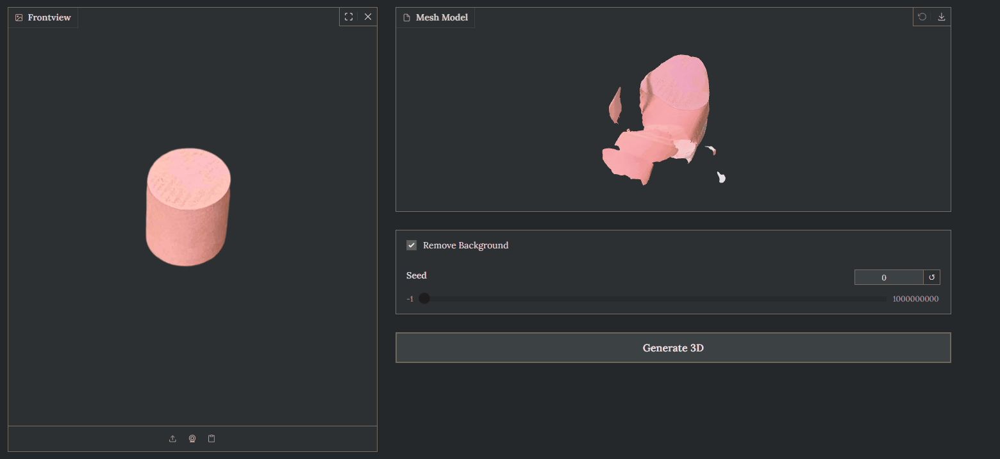

# Unique3D 使用说明
## 环境安装
注意使用cuda版本

有些库可能无法直接安装，可使用源码安装的方式，比如nvdiffrast，pytorch3d，onnxruntime_gpu等

基于源码安装python包时，注意环境:
```bash
conda activate unique3d
cd pytorch3d
pip install . --no-build-isolation
```

## 硬件要求：
- 16GB显存

## 运行示例
需提供无背景的物品图片，点击生成即可（速度以实际使用显卡为准）




